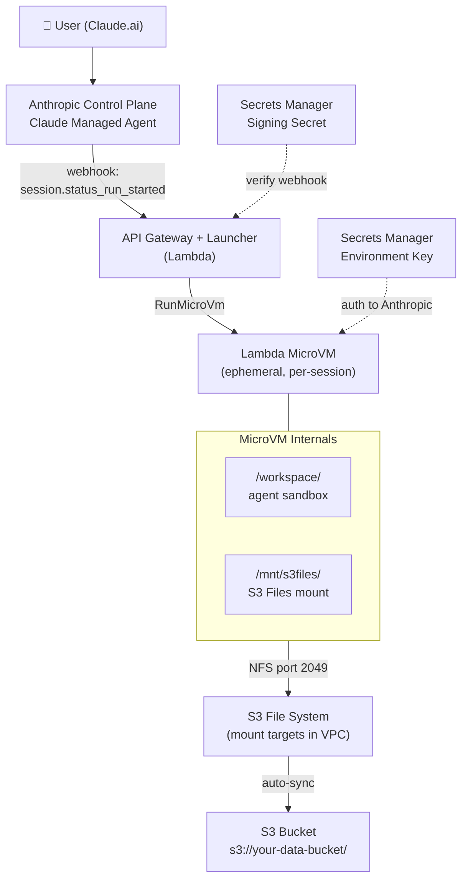

# Data Analyst Agent with S3 Files Access

A complete example of a Claude Managed Agent that analyzes files stored in Amazon S3
using [S3 Files](https://aws.amazon.com/s3/features/files/) — a POSIX file system
interface backed by S3. The agent runs inside an isolated AWS Lambda MicroVM and
reads/writes your data as if it were a local filesystem.

## Use Case

> "Analyze last quarter's sales data and generate a summary report with
> regional performance breakdown."

The agent:
1. Reads CSV files from your S3 bucket via a mounted filesystem
2. Runs Python (pandas, matplotlib) to analyze the data
3. Generates charts and a summary report
4. Writes the output back — it appears in your S3 bucket automatically

No SDK calls, no download/upload logic. The agent sees files at
`/mnt/s3files/` and works with them using standard file operations.

## Architecture



### Credential Boundaries

| Component | Can Access | Cannot Access |
|-----------|-----------|---------------|
| Launcher Lambda | Webhook signing secret | Environment key, S3 data |
| MicroVM | Environment key, S3 Files (read/write) | Signing secret, other buckets |
| S3 Files | Scoped to one bucket/prefix | Other AWS resources |

The organization API key never reaches AWS compute.

## Prerequisites

- Everything from the [base sample prerequisites](../../README.md#prerequisites)
- An S3 general purpose bucket with your data (or use the provided sample data)
- A VPC with at least 2 subnets in different AZs (default VPC works)
- The Claude Platform on AWS SDK: `pip install anthropic`

### Important: MicroVM Image Requirements

The MicroVM image **must** be created with:

```bash
--additional-os-capabilities '["ALL"]'
```

This enables NFS filesystem mounts inside the container (required for S3 Files).
Without it, `mount()` syscalls are denied by the default restricted Linux capabilities.

The image must also use the Lambda MicroVM managed base image:
```bash
--base-image-arn arn:aws:lambda:<region>:aws:microvm-image:al2023-1
```

A **VPC egress network connector** is required so the MicroVM can reach
S3 Files mount targets (NFS port 2049) within the VPC. The `deploy.sh`
script creates this automatically.

## Quick Start

### 1. Deploy the Infrastructure

```bash
cd examples/s3-files-data-analyst

# Configure (edit values in samconfig.toml)
cp infrastructure/samconfig.toml.example infrastructure/samconfig.toml

# Deploy
./scripts/deploy.sh
```

### 2. Upload Sample Data

```bash
./scripts/upload-sample-data.sh
```

This places sample sales CSVs into your S3 bucket under the `data/` prefix.

### 3. Configure the Agent

In the [Claude Console](https://console.anthropic.com):

1. Create a new **Managed Agent** (or use an existing one)
2. Set the system prompt from [`agent/system-prompt.md`](agent/system-prompt.md)
3. Create a **self-hosted environment** pointing at your deployed webhook URL
4. Register the webhook endpoint (from `sam deploy` outputs)

Or use the SDK (see [`agent/setup-agent.py`](agent/setup-agent.py)).

### 4. Demo

```bash
# Create a session and watch the agent work
./scripts/demo.sh
```

Or use the notebook: [`agent/demo.ipynb`](agent/demo.ipynb)

## Project Structure

```
examples/s3-files-data-analyst/
├── README.md                          # This file
├── infrastructure/
│   ├── template.yaml                  # SAM template (standalone, complete)
│   └── samconfig.toml.example         # Sample deploy config
├── agent/
│   ├── system-prompt.md               # CMA system prompt (data analyst)
│   ├── setup-agent.py                 # SDK script to configure the agent
│   └── demo.ipynb                     # Interactive demo notebook
├── microvm-image/
│   ├── Dockerfile                     # AL2023 + Python data libs + NFS
│   └── worker/
│       ├── worker.mjs                 # Extended worker with S3 Files mount
│       ├── mount-s3files.sh           # NFS mount helper
│       └── package.json               # Node deps
├── sample-data/
│   ├── sales-q1-2026.csv             # Sample: Q1 regional sales
│   ├── sales-q2-2026.csv             # Sample: Q2 regional sales
│   └── README.md                      # Data dictionary
├── scripts/
│   ├── deploy.sh                      # One-command deploy
│   ├── upload-sample-data.sh          # Push sample data to S3
│   ├── demo.sh                        # Trigger a session end-to-end
│   └── teardown.sh                    # Clean up everything
├── tests/
│   ├── unit/                          # Fast, no AWS required
│   ├── integration/                   # Needs AWS credentials
│   └── e2e/                           # Full deployed stack
└── docs/
    └── architecture.png               # Diagram (source: README above)
```

## How It Works

### S3 Files vs S3 API

This example uses **S3 Files** (POSIX filesystem), not S3 API calls:

| | S3 API (GetObject/PutObject) | S3 Files (NFS mount) |
|---|---|---|
| Agent code | Needs AWS SDK, explicit download/upload | Standard `open()`, `read()`, `write()` |
| Large buckets | Must download everything upfront | Lazy-loads only what's accessed |
| Write-back | Explicit `PutObject` after processing | Automatic sync to S3 |
| Worker complexity | Pre/post sync hooks, retry logic | One `mount` command |
| Agent experience | Custom tools needed | Native file access |

### MicroVM Lifecycle with S3 Files

1. **Webhook fires** → Launcher creates MicroVM with S3 Files config in dispatch
2. **MicroVM /run hook** → Worker mounts the S3 filesystem at `/mnt/s3files/`
3. **Session starts** → Agent sees files as local paths, reads/writes freely
4. **Session ends** → Writes have already synced to S3; MicroVM exits

### Security

- The MicroVM's execution role has `elasticfilesystem:ClientMount` and
  `elasticfilesystem:ClientWrite` scoped to the specific file system
- S3 Files uses NFS close-to-open consistency — concurrent sessions see
  each other's committed writes
- The file system can be scoped to a bucket prefix (e.g., `data/`) so the
  agent can't access other prefixes

## Customization

### Use Your Own Data

Replace the sample CSVs with your files:
```bash
aws s3 cp your-data/ s3://your-bucket/data/ --recursive
```

The agent will see them at `/mnt/s3files/data/`.

### Change the Agent Persona

Edit [`agent/system-prompt.md`](agent/system-prompt.md) — the sample is a data
analyst, but you could make it a code reviewer, document processor, ETL debugger,
etc.

### Scope Access to a Prefix

Set the `FileSystemPrefix` parameter in `template.yaml` to restrict the
filesystem to a specific S3 prefix:
```yaml
FileSystemPrefix: "agents/data-analyst/"
```

## Tear Down

```bash
./scripts/teardown.sh
```

This removes: the SAM stack, the S3 file system, mount targets, and the
sample data (your original bucket remains).

## Troubleshooting

### MicroVM Image Build Fails

**"The container image build failed"** with no logs:

1. **Build role trust policy**: Must allow `sts:AssumeRole` AND `sts:TagSession`
   from `lambda.amazonaws.com`. Do NOT add `aws:SourceAccount` conditions —
   they block the build service from assuming the role.

   ```yaml
   AssumeRolePolicyDocument:
     Statement:
       - Effect: Allow
         Principal:
           Service: lambda.amazonaws.com
         Action:
           - "sts:AssumeRole"
           - "sts:TagSession"
   ```

2. **Build role S3 access**: Needs both `s3:GetObject` and `s3:PutObject`
   on the artifact bucket.

3. **SDK version**: Use `@anthropic-ai/sdk@^0.104.1` — the `WorkPoller` and
   `EnvironmentWorker` imports are at `@anthropic-ai/sdk/helpers/beta/environments`.

### S3 Files Filesystem Stuck in "error"

**"Access denied: S3 Files does not have permissions to assume the provided role"**:

- The trust principal must be `elasticfilesystem.amazonaws.com`, NOT
  `s3files.amazonaws.com` (which is not a valid IAM principal).
- S3 bucket must have **versioning enabled** before creating the filesystem.
- The role policy must include `s3:GetBucketVersioning` and `s3:ListBucketVersions`.

### MicroVM Exits Immediately (Exit Code 1)

- Check the Secrets Manager secret contains the actual environment key
  (not a placeholder).
- Ensure the execution role can access the secret in the same region.
- Verify network egress: the MicroVM needs internet access for the Anthropic API
  and VPC access for S3 Files NFS mounts (port 2049).

### Lambda MicroVMs CLI Not Found

The `aws lambda-microvms` subcommand requires the service model. Install from
the vendored botocore wheel:
```bash
cd src/functions/wheels
unzip -o botocore-*.whl 'botocore/data/lambda-microvms/*' -d $(python3 -c 'import botocore; print(botocore.__path__[0] + "/../")')
```

## Related

- [Base sample: Lambda MicroVM control plane](../../README.md)
- [Claude Platform on AWS notebooks](https://github.com/aws-samples/anthropic-on-aws/tree/main/claude-platform-on-aws/notebooks)
- [S3 Files documentation](https://docs.aws.amazon.com/AmazonS3/latest/userguide/s3-files.html)
- [Claude Managed Agents docs](https://platform.claude.com/docs/en/managed-agents/agent-setup)
